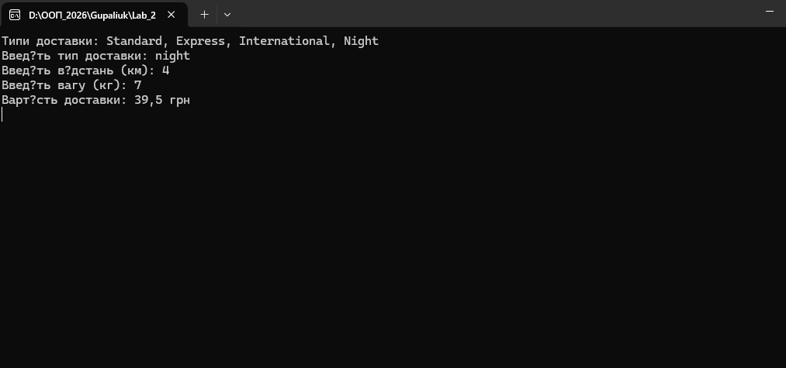

# Лабораторна робота №21

## Тема

**OCP: гнучкі алгоритми розрахунку (Factory / Strategy)**

## Мета роботи

Застосувати принцип відкритості/закритості (**Open/Closed Principle, OCP**) для створення гнучкої та розширюваної системи розрахунку вартості доставки з використанням патернів **Strategy** та **Factory Method**. Забезпечити можливість додавання нових алгоритмів розрахунку без зміни існуючого коду.

---

## Опис завдання

Реалізовано консольний застосунок для розрахунку вартості доставки залежно від типу доставки, відстані та ваги відправлення.

У програмі використано:

* **Strategy** — для інкапсуляції різних алгоритмів розрахунку;
* **Factory Method** — для створення потрібної стратегії на основі вибору користувача;
* **OCP** — система відкрита для розширення та закрита для модифікації.

---

## Архітектура рішення

### Інтерфейс стратегії

* `IShippingStrategy`

  * Метод: `decimal CalculateCost(decimal distance, decimal weight)`

### Реалізовані стратегії

* `StandardShippingStrategy` — стандартна доставка
* `ExpressShippingStrategy` — експрес-доставка з фіксованою доплатою
* `InternationalShippingStrategy` — міжнародна доставка з податком
* `NightShippingStrategy` — нічна доставка (додаткова націнка)

### Фабрика

* `ShippingStrategyFactory`

  * Створює відповідну стратегію залежно від типу доставки

### Контекст

* `DeliveryService`

  * Працює тільки з інтерфейсом `IShippingStrategy`
  * Не залежить від конкретних реалізацій

---

## Демонстрація принципу OCP

Для розширення функціональності було додано новий клас `NightShippingStrategy`.

При цьому:

* клас `DeliveryService` **не змінювався**;
* існуючі стратегії залишились без змін;
* додано лише нову реалізацію інтерфейсу та підтримку у фабриці.

Це демонструє дотримання принципу **Open/Closed Principle**.

---

## Робота програми

1. Користувач вводить:

   * тип доставки;
   * відстань (км);
   * вагу (кг).
2. Фабрика створює відповідну стратегію.
3. `DeliveryService` розраховує вартість доставки.
4. Результат виводиться у консоль.

Результати роботи виводяться у консоль:

---

## Використані патерни проєктування

* **Strategy**
* **Factory Method**

---

## Технології

* Мова програмування: **C#**
* Тип проєкту: **Console Application**
* Платформа: **.NET**

---

## Висновок

У ході виконання лабораторної роботи було реалізовано гнучку систему розрахунку вартості доставки з використанням патернів Strategy та Factory Method. Принцип відкритості/закритості дотримано, оскільки система легко розширюється шляхом додавання нових стратегій без зміни існуючої бізнес-логіки.
