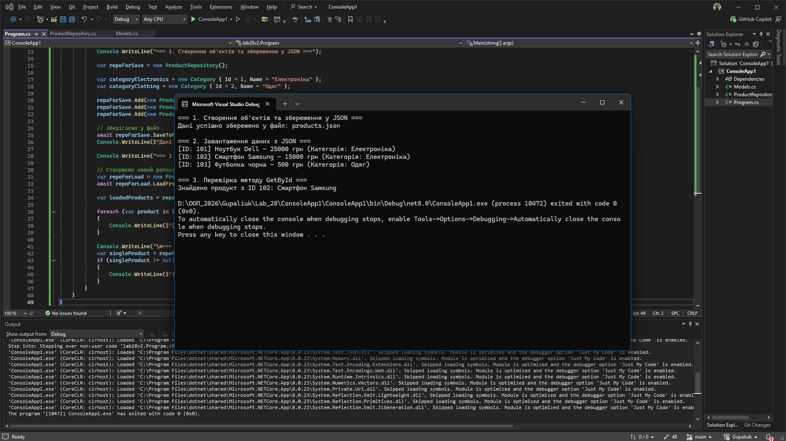

# Лабораторна робота №28: Серіалізація об’єктів у JSON

**Студент:** Gupaliuk Roman
**Варіант:** 2 (Інтернет-магазин)

## Опис проєкту
Метою лабораторної роботи є вивчення процесу серіалізації та десеріалізації об'єктів у форматі JSON за допомогою вбудованої бібліотеки `System.Text.Json`.

В рамках роботи створено консольний застосунок для предметної області "Інтернет-магазин".

## Реалізовані компоненти
1. **Моделі:** * `Product` (Товар)
   * `Category` (Категорія)
2. **Репозиторій (`ProductRepository`):**
   * Інкапсулює логіку зберігання товарів у списку.
   * Реалізує CRUD-подібні методи: `Add()`, `GetAll()`, `GetById()`.
   * Містить асинхронні методи роботи з файловою системою: `SaveToFileAsync()` та `LoadFromFileAsync()`.
3. **Головна програма (`Main`):**
   * Демонструє створення об'єктів.
   * Зберігає об'єкти у файл `products.json`.
   * Ініціалізує новий репозиторій та завантажує дані з цього ж файлу.
   * Виводить відновлені об'єкти на екран.

