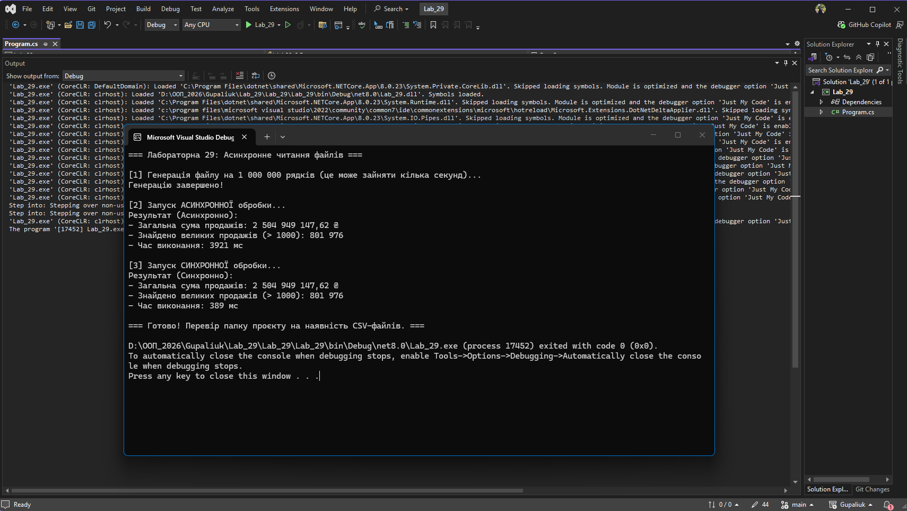

# Лабораторна робота №29: Асинхронне читання великих файлів

**Студент:** Gupaliuk Roman
**Варіант:** 2 (Продажі: Підрахувати загальну суму)

## Опис проєкту
Мета роботи — навчитися ефективно обробляти великі масиви даних (файли розміром 1,000,000+ рядків) за допомогою потокового читання (`StreamReader` / `StreamWriter`). Це дозволяє обробляти гігабайтні файли, не перевантажуючи оперативну пам'ять (RAM).

## Реалізований функціонал
1. **Генератор:** Створює CSV-файл `sales_data.csv` на 1,000,000 рядків із випадковими транзакціями.
2. **Асинхронний процесор:** Читає файл по одному рядку (`ReadLineAsync`), сумує загальний дохід і паралельно записує транзакції на суму > 1000 у новий файл (`high_sales_async.csv`).
3. **Синхронний процесор:** Виконує ту саму задачу для порівняння продуктивності.
4. **Бенчмарк:** Використано клас `Stopwatch` для вимірювання часу виконання обох підходів.

## Аналіз продуктивності
*Синхронне* читання у консольному застосунку часто відпрацьовує швидше через відсутність накладних витрат на перемикання контексту та state-machine (яка створюється під капотом `async/await`). Проте використання *асинхронного* потокового читання є стандартом для серверних застосунків, оскільки воно не блокує головний потік і дозволяє масштабувати систему.

