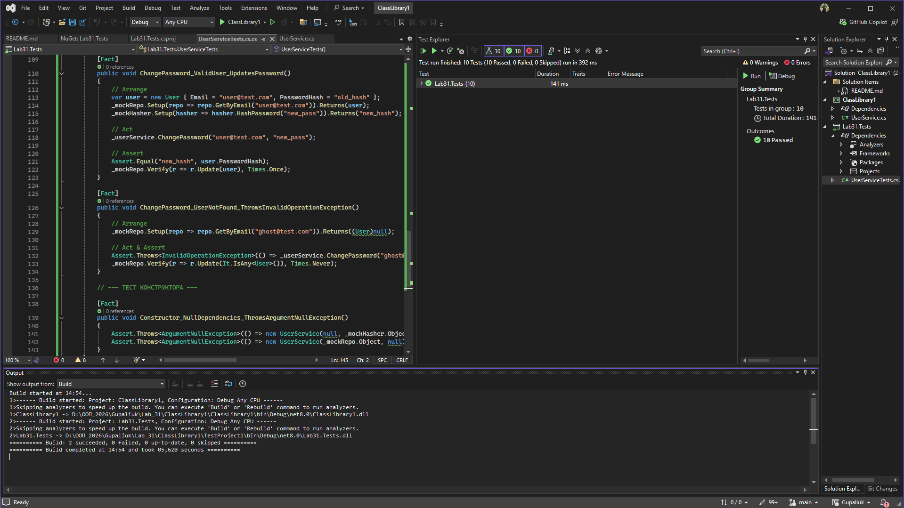

# Лабораторна робота №31: Тестування з Moq

**Студент:** Gupaliuk Roman
**Варіант:** 2 (UserService)

## Опис проєкту
Мета роботи — навчитися створювати mock-об'єкти за допомогою бібліотеки **Moq** для ізольованого тестування бізнес-логіки.

В рамках роботи реалізовано:
1. `UserService` — сервіс, що відповідає за реєстрацію, логін та зміну пароля користувача.
2. Залежності `IUserRepository` та `IPasswordHasher`, які впроваджуються через Dependency Injection.
3. Тестовий проєкт з використанням `xUnit` та `Moq`.

## Особливості тестування
Написано **9 юніт-тестів**, у яких активно використовуються:
* `Setup()` — для імітації відповідей від бази даних та системи хешування.
* `Verify()` — для перевірки факту виклику методів (наприклад, чи викликався метод `Add` при успішній реєстрації, і чи **не** викликався при помилці).
* `It.IsAny<T>()` та `It.Is<T>()` — для гнучкої перевірки аргументів.

Усі тести успішно проходять.
