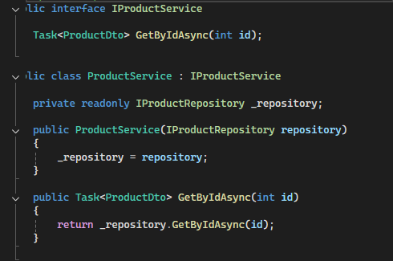
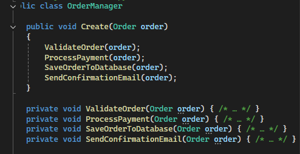
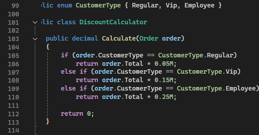

# Звіт з аналізу SOLID принципів (SRP, OCP) в Open-Source проєкті

## 1. Обраний проєкт

* **Назва:** Humanizer
* **Посилання на GitHub:** [https://github.com/n4r2r776fy-cpu/Gupaliuk/tree/main/Cam_15/Cam_15]

## 2. Аналіз SRP (Single Responsibility Principle)

### 2.1. Приклади дотримання SRP

#### Клас: `DateHumanizeExtensions`

* **Відповідальність:** Формує «людські» рядки для дати та часу (наприклад, “2 години тому”, “вчора”).
* **Обґрунтування:** Клас має одну чітку відповідальність – конвертацію дат у читабельний формат.

#### Клас: `NumberHumanizeExtensions`

* **Відповідальність:** Формує «людські» рядки для чисел (наприклад, 1000 → "1K").
* **Обґрунтування:** Відповідальність обмежена лише числами; немає логіки для дат чи інших типів.

### 2.2. Приклади порушення SRP

#### Клас: `TimeSpanHumanize`

* **Множинні відповідальності:**

  1. Конвертація `TimeSpan` у рядки.
  2. Локалізація під різні культури.
  3. Форматування для різних стилів (короткий, довгий).
* **Проблеми:** Складно тестувати та модифікувати, будь-яка зміна локалізації чи формату вплине на основну функціональність.

## 3. Аналіз OCP (Open/Closed Principle)

### 3.1. Приклади дотримання OCP

#### Модуль: `IFormatter` інтерфейс

* **Механізм розширення:** Інтерфейс дозволяє додавати нові формати без зміни існуючих класів.
* **Обґрунтування:** Нові реалізації можуть додавати форматування для чисел або дат, не змінюючи базовий код.

#### Модуль: Стратегія локалізації

* **Механізм розширення:** Використання абстрактного класу або словника ресурсів для додавання нових мов.
* **Обґрунтування:** Додаючи нову культуру, не потрібно змінювати базовий Humanizer код.

### 3.2. Приклади порушення OCP

#### Модуль: Humanize `switch` в `TimeSpanHumanize`

* **Проблема:** Додати новий формат часу потребує зміни існуючого `switch-case` блоку.
* **Наслідки:** Порушує OCP; зміни в одному місці можуть ненавмисно вплинути на вже існуючі формати.

## 4. Загальні висновки

Проєкт Humanizer добре дотримується принципів SRP та OCP у більшості модулів: класи мають чіткі обов’язки, а розширення функціональності реалізоване через інтерфейси та абстракції.
Проте є деякі класи, як `TimeSpanHumanize`, які порушують SRP та OCP через накопичення логіки і великі `switch` блоки. Це ускладнює підтримку, тестування та локалізацію, і може призвести до помилок при додаванні нових функцій.
