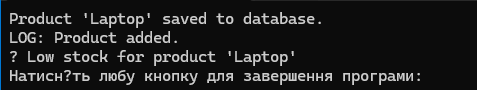

# Самостійна робота №16

## Тема

**Схема розподілу відповідальностей модуля. Принцип єдиної відповідальності (SRP)**

---

## Мета роботи

Навчитися застосовувати принцип єдиної відповідальності (SRP) для декомпозиції складного модуля на менші, більш сфокусовані класи, а також візуалізувати розподіл відповідальностей за допомогою UML-діаграми класів.

---

## Варіант завдання

**Варіант 2 — ProductManager**

**Початкові відповідальності класу:**

* додавання продукту
* оновлення ціни
* логування
* сповіщення про низький запас

**Рефакторинг:**

* `IProductValidator`
* `IProductRepository`
* `ILogger`
* `IStockNotifier`
* `ProductService`

---

## Опис виконання роботи

### 1. Створення проєкту

Було створено консольний проєкт **IndependentWork16** за допомогою команди:

```bash
dotnet new console -o IndependentWork16
```

---

### 2. Реалізація "поганого" класу

Було створено клас `ProductManager`, який порушує принцип SRP, оскільки виконує одразу кілька різних відповідальностей: валідацію продукту, збереження, логування та сповіщення.

Такий підхід ускладнює підтримку та розширення коду і є прикладом **God Object**.

---

### 3. Рефакторинг згідно SRP та DIP

Функціональність класу `ProductManager` була розділена на окремі інтерфейси та класи:

* `IProductValidator` — відповідає за валідацію даних продукту
* `IProductRepository` — відповідає за збереження продукту
* `ILogger` — відповідає за логування
* `IStockNotifier` — відповідає за сповіщення про низький запас
* `ProductService` — координує роботу компонентів

Клас `ProductService` залежить від **абстракцій (інтерфейсів)**, що відповідає принципу інверсії залежностей (DIP).

---

### 4. UML-діаграма класів

Для візуалізації структури було створено UML-діаграму класів у форматі **Mermaid**, яка відображає:

* всі інтерфейси та класи
* реалізацію інтерфейсів
* залежності між компонентами

---

### 5. Демонстрація роботи

У методі `Main` створюються екземпляри реалізацій інтерфейсів та передаються у `ProductService`. Після цього викликається метод додавання продукту, а результати роботи виводяться у консоль.

### Запуск програми:


---

## Контрольні питання

### 1. Поясніть принцип єдиної відповідальності (SRP).

Принцип SRP означає, що кожен клас повинен мати лише одну причину для змін і відповідати лише за одну чітко визначену задачу.

### 2. Що таке God Object?

God Object — це клас, який концентрує в собі надто багато логіки та відповідальностей, що порушує SRP та ускладнює підтримку коду.

### 3. Як декомпозиція допомагає дотримуватися SRP?

Декомпозиція дозволяє розбити складний клас на менші компоненти, кожен з яких має одну відповідальність, що робить систему гнучкішою та зрозумілішою.

### 4. Як UML-діаграми допомагають у проєктуванні?

UML-діаграми наочно показують структуру системи, зв’язки між класами та інтерфейсами, що полегшує аналіз і перевірку дотримання принципів ООП.

---

## Висновок

У ході виконання роботи було реалізовано приклад порушення принципу SRP та виконано його рефакторинг. Застосування принципів SRP та DIP дозволило отримати гнучку, масштабовану та зрозумілу архітектуру модуля.

---
