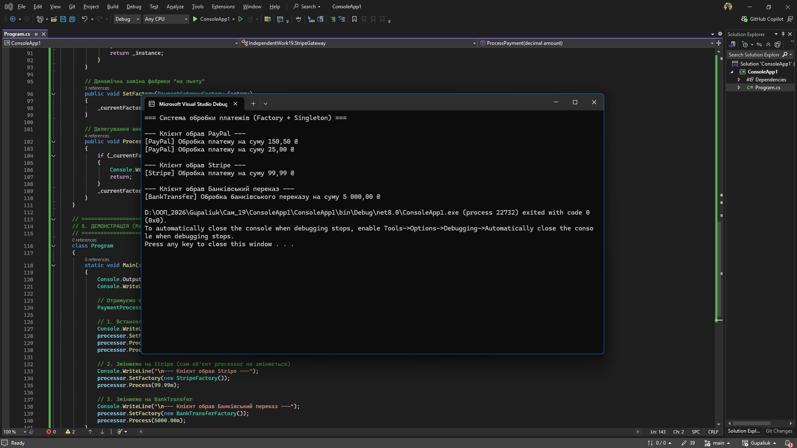

# Самостійна робота №19: Фабрики + Singleton

**Студент:** Gupaliuk Roman
**Варіант:** 2 (Система обробки платежів)

## Опис проєкту
Метою роботи є вивчення та практичне застосування патернів проєктування **Factory Method** (Фабричний метод) та **Singleton** (Одинак). 

В рамках проєкту реалізовано:
1. Інтерфейс `IPaymentGateway` та три його реалізації (`PayPalGateway`, `StripeGateway`, `BankTransferGateway`).
2. Абстрактний клас `PaymentGatewayFactory` з фабричним методом `CreateGateway()`.
3. Три конкретні фабрики для створення відповідних платіжних шлюзів.
4. Клас `PaymentProcessor`, реалізований за патерном **Singleton**, який керує викликами платежів і дозволяє динамічно змінювати фабрику під час виконання програми.

---

## Відповіді на контрольні питання

### 1. Поясніть патерн Factory Method. Які проблеми він вирішує?
Патерн **Factory Method** визначає загальний інтерфейс для створення об'єктів у суперкласі, але дозволяє підкласам змінювати тип створюваних об'єктів. 
**Які проблеми вирішує:** Він усуває проблему жорсткої прив'язки (tight coupling) коду до конкретних класів. Якщо потрібно додати новий спосіб оплати (наприклад, Crypto), не потрібно переписувати існуючий код, достатньо створити нову фабрику, що реалізує існуючий інтерфейс. Це відповідає принципу Open/Closed (OCP).

### 2. Поясніть патерн Singleton. Коли його доцільно використовувати, а коли варто уникати?
Патерн **Singleton** гарантує, що у класу є лише один екземпляр на всю програму, і надає глобальну точку доступу до нього.
* **Доцільно використовувати:** Для компонентів, які мають бути унікальними та керувати спільними ресурсами (наприклад, менеджери конфігурацій, підключення до БД, логери, наш платіжний процесор).
* **Варто уникати:** Якщо глобальний стан ускладнює юніт-тестування (бо тести починають залежати один від одного) або якщо патерн маскує поганий дизайн і реальні залежності в коді.

### 3. Як ці два патерни можуть працювати разом для створення гнучкої та контрольованої системи?
Singleton діє як "єдиний центр управління" системою (`PaymentProcessor`), до якого клієнтський код має зручний доступ. Factory Method забезпечує цьому центру гнучкість. Замість того, щоб жорстко прописувати логіку створення платежів всередині Singleton, ми передаємо йому потрібну Фабрику. У результаті Singleton просто викликає метод `Process()`, а те, як саме буде створено і проведено платіж, вирішує конкретний підклас фабрики.

### 4. Які переваги дає використання абстракцій (інтерфейсів) у поєднанні з Factory Method та Singleton?
Це забезпечує дотримання принципу інверсії залежностей (**DIP**). Клієнтський код (у нашому випадку `Program.cs` та сам `PaymentProcessor`) залежить лише від абстракцій (`IPaymentGateway`, `PaymentGatewayFactory`), а не від конкретних реалізацій (`PayPalGateway` тощо). Це робить систему максимально гнучкою, полегшує тестування (можна легко підставити Mock-об'єкти) і дозволяє безпечно розширювати функціонал без ризику "зламати" старий код.
