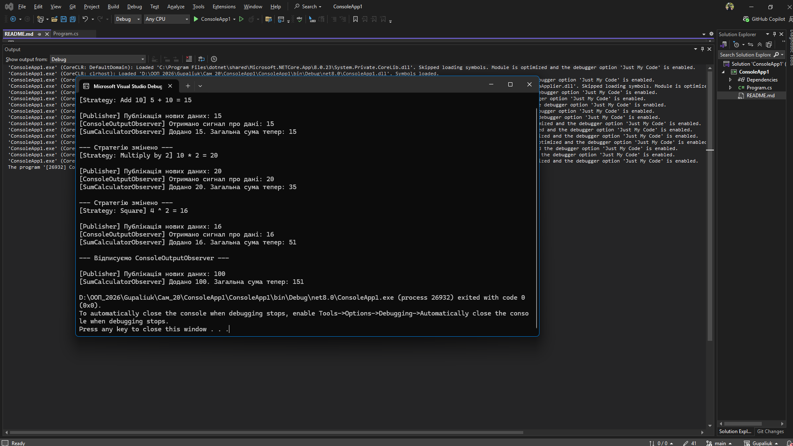

# Самостійна робота №20: Strategy + Observer

**Студент:** [Твоє Прізвище та Ім'я]
**Варіант:** 2 (Обробка числових даних)

## Опис проєкту
Проєкт демонструє використання двох поведінкових патернів проєктування:
1. **Strategy** — для динамічної зміни алгоритмів обробки числових даних під час виконання програми (`AddTenStrategy`, `MultiplyByTwoStrategy`, `SquareStrategy`).
2. **Observer** — реалізований за допомогою вбудованих подій (`event`) та делегатів (`Action`) у C#, що дозволяє підписувати кілька незалежних класів (`ConsoleOutputObserver`, `SumCalculatorObserver`) на оновлення від головного видавця (`DataPublisher`).

---

## Відповіді на контрольні питання

### 1. Поясніть патерн Strategy. Як він дозволяє змінювати поведінку об’єкта під час виконання?
Патерн **Strategy** (Стратегія) інкапсулює набір споріднених алгоритмів у власні класи та робить їх взаємозамінними через спільний інтерфейс. Він дозволяє змінювати поведінку об'єкта в рантаймі (під час виконання), оскільки основний клас (Контекст) зберігає лише посилання на інтерфейс стратегії, а не конкретну реалізацію. Завдяки методам на кшталт `SetStrategy()` ми можемо підмінити об'єкт алгоритму на інший, не зупиняючи і не переписуючи програму.

### 2. Поясніть патерн Observer. Як він забезпечує слабке зв’язування між суб’єктом та спостерігачами?
Патерн **Observer** (Спостерігач) створює механізм підписки, що дозволяє одним об'єктам (Спостерігачам) стежити й реагувати на події, які відбуваються в іншому об'єкті (Суб'єкті/Видавці). 
**Слабке зв'язування** досягається тим, що Суб'єкт нічого не знає про конкретні класи Спостерігачів. Він працює лише зі списком підписників. Спостерігачів можна додавати, видаляти або змінювати без жодних змін у коді Суб'єкта.

### 3. Як події та делегати в C# використовуються для реалізації патерну Observer?
У C# патерн Observer вбудований на рівні мови. 
* **Делегати** (наприклад, `Action<T>`) визначають сигнатуру методу, який може бути викликаний. Це своєрідний "вказівник" на метод.
* **Події** (`event`) працюють як обгортка над делегатами. Вони дозволяють іншим класам безпечно підписуватися (`+=`) та відписуватися (`-=`) від сповіщень, але забороняють викликати цю подію ззовні (викликати її може лише сам клас-Видавець).

### 4. Наведіть приклад, як комбінація Strategy та Observer може створити гнучку та розширювану систему.
Комбінація цих патернів ідеальна для конвеєрів обробки даних (наприклад, у нашому завданні). 
* **Strategy** вирішує **ЯК** обробляти дані (наприклад, застосувати фільтр до фотографії: сепія чи чорно-біле). Користувач може змінити фільтр кнопкою в UI, і система просто підмінить стратегію.
* **Observer** вирішує, **ЩО РОБИТИ ДАЛІ** з результатом. Після того як Strategy закінчила роботу, Суб'єкт викликає подію. Спостерігач A (UI) оновить картинку на екрані, Спостерігач B (Logger) запише дію у файл, а Спостерігач C (CloudSaver) почне завантаження фото в хмару. Додавання нових фільтрів (Стратегій) чи нових реакцій (Спостерігачів) не зламає існуючий код.

