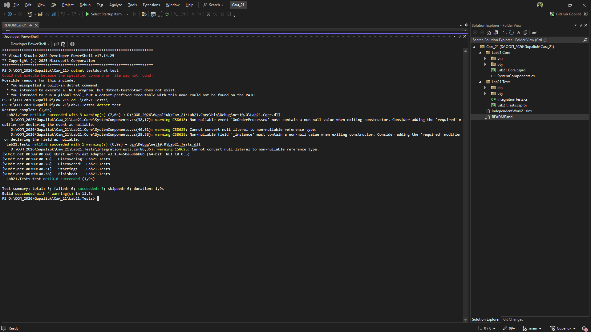

# Самостійна робота №21: Інтеграційні тести патернів

**Студент:** Gupaliuk Roma
**Варіант:** 2

## Опис проєкту
Мета роботи — перевірити коректну взаємодію кількох патернів проєктування (Singleton, Factory, Strategy, Observer) у єдиному життєвому циклі за допомогою інтеграційних тестів на базі фреймворку **xUnit**.

Для тестування розроблено єдину підсистему `ProcessingHub` (Центр обробки замовлень), яка використовує всі вищезгадані патерни.

## Сценарії тестування

### Позитивні сценарії:
1. **FullSystemIntegration_WorksCorrectly:** * *Очікування:* Фабрика створює потрібне сповіщення, Стратегія коректно розраховує знижку, Observer успішно отримує оновлену суму.
   * *Фактичний результат:* Тест пройдено успішно. Всі компоненти взаємодіють без помилок.
2. **SingletonState_IsPreservedAcrossCalls:** * *Очікування:* Зміна стану (наприклад, Стратегії) через одне посилання на Singleton повинна бути видимою через будь-яке інше посилання.
   * *Фактичний результат:* Тест пройдено успішно (`Assert.Same` підтвердив ідентичність об'єктів).
3. **StrategyChangeAtRuntime_ChangesOutcome:** * *Очікування:* Зміна стратегії під час виконання програми (Runtime) має миттєво впливати на результати наступних розрахунків.
   * *Фактичний результат:* Тест пройдено успішно.

### Негативні / Граничні сценарії:
4. **MissingDependencies_ThrowsInvalidOperationException:** * *Очікування:* Якщо клієнтський код зберіг Singleton, але забув передати або занулив обов'язкову Стратегію/Фабрику, система має викинути `InvalidOperationException`.
   * *Фактичний результат:* Тест пройдено успішно.
5. **UnsubscribedObserver_DoesNotReceiveNotifications:** * *Очікування:* Якщо об'єкт відписався від події (через `-=`), він більше не повинен отримувати жодних сповіщень.
   * *Фактичний результат:* Тест пройдено успішно. Стан незалежного підписника не змінюється.

## Висновки по ризиках
1. **Проблема стану Singleton у тестах:** Оскільки Singleton тримає стан глобально, тести можуть впливати один на одного. **Рішення:** Реалізовано метод `ResetForTesting()`, який викликається через інтерфейс `IDisposable` перед/після кожного тесту.
2. **Нульові посилання (Null Reference):** Динамічна підміна стратегій створює ризик `NullReferenceException`. **Рішення:** У методі `ProcessOrder` додано жорстку перевірку залежностей перед виконанням логіки.

