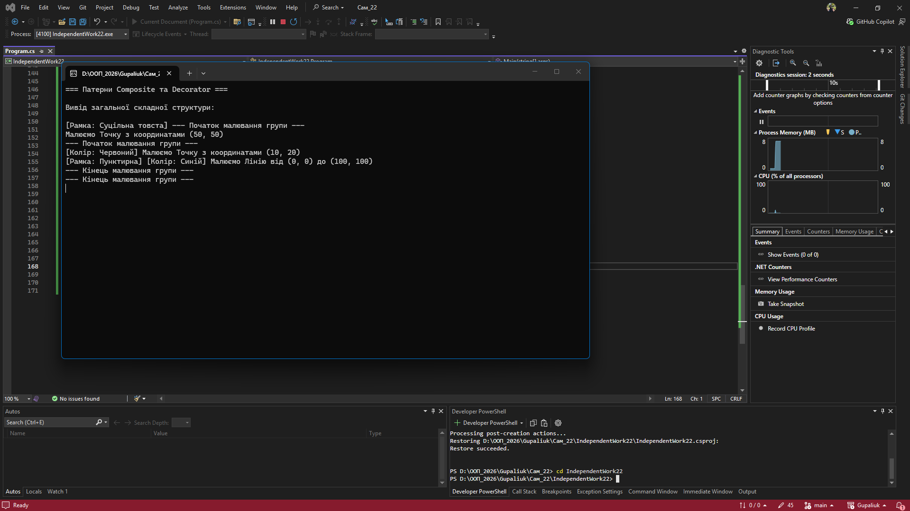

# Самостійна робота №22: Composite + Decorator

**Студент:** Gupaliuk Roman
**Варіант:** 2 (Графічні елементи)

## Опис проєкту
Проєкт демонструє використання структурних патернів проєктування:
* **Composite:** Дозволяє групувати графічні примітиви (`Point`, `Line`) у складні структури (`GraphicGroup`) та працювати з ними через єдиний інтерфейс `IComponent`.
* **Decorator:** Дозволяє динамічно обгортати об'єкти додатковим функціоналом (`ColorDecorator`, `BorderDecorator`), не змінюючи код самих класів фігур.

---

## Відповіді на контрольні питання

### 1. Поясніть патерн Composite. Як він дозволяє працювати з ієрархічними структурами?
Патерн **Composite** (Компонувальник) структурує об'єкти у вигляді деревоподібної ієрархії (частина-ціле). Він має спільний інтерфейс для простих елементів (Leaf) та груп (Composite). Завдяки цьому клієнтському коду байдуже, працює він з однією точкою чи з масивною групою, що містить тисячі фігур — він просто викликає метод `Draw()`, а Composite сам делегує цей виклик усім своїм дочірнім елементам по ланцюжку.

### 2. Поясніть патерн Decorator. У чому його перевага над наслідуванням для розширення функціональності?
Патерн **Decorator** (Декоратор) динамічно додає нову поведінку об'єкту, обгортаючи його в інший об'єкт-обгортку з таким самим інтерфейсом. 
**Переваги над наслідуванням:** 1. Дозволяє додавати функціонал у процесі виконання програми (в рантаймі).
2. Запобігає "вибуху кількості класів". Якби ми використовували наслідування, для кожної комбінації довелося б створювати окремий клас (`RedPoint`, `BluePoint`, `RedDottedLine` тощо). З декораторами ми просто комбінуємо існуючі обгортки (як матрьошки).

### 3. Як можна комбінувати Composite та Decorator для створення складних та гнучких систем?
Обидва патерни покладаються на спільний інтерфейс (`IComponent`). Оскільки і Leaf, і Composite, і Decorator реалізують цей інтерфейс, їх можна безперешкодно комбінувати. Ми можемо застосувати `BorderDecorator` як до окремої лінії (`Line`), так і до цілої групи фігур (`GraphicGroup`). У такому випадку рамка буде застосована до результату малювання всієї групи.

### 4. Наведіть приклад, коли використання Composite або Decorator є більш доцільним, ніж інші підходи.
**Composite:** Графічні інтерфейси користувача (GUI). Вікно (Window) — це Composite, який містить панелі (Panels), які в свою чергу містять кнопки (Buttons) та текстові поля (TextFields). При закритті вікна метод `Close()` рекурсивно викликається для всіх елементів.
**Decorator:** Система потоків вводу/виводу в C# (`Stream`). У нас є базовий `FileStream` (читає байти). Ми можемо обгорнути його в `BufferedStream` (для швидкості), а потім обгорнути в `GZipStream` (для декомпресії). При цьому базовий клас файлу не змінюється.

