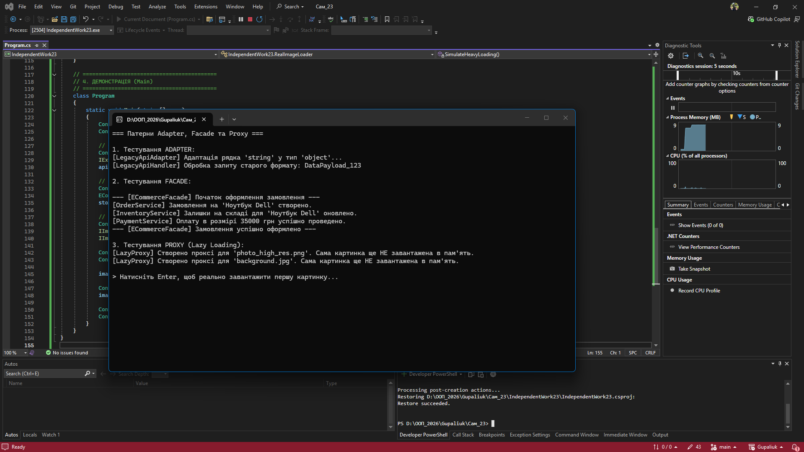

# Самостійна робота №23: Adapter + Facade + Proxy

**Студент:** Gupaliuk Roman
**Варіант:** 2 (Робота з зовнішнім API)

## Опис проєкту
Проєкт демонструє використання трьох структурних патернів для покращення архітектури:
1. **Adapter** (`LegacyApiAdapter`): Дозволяє клієнтському коду, що очікує передачу `string`, працювати зі старою бібліотекою (`LegacyApiHandler`), яка приймає тільки `object`.
2. **Facade** (`ECommerceFacade`): Приховує складність підсистеми створення замовлення. Замість того, щоб клієнт вручну викликав `OrderService`, `InventoryService` та `PaymentService`, він викликає один метод `PlaceOrder()`.
3. **Proxy** (`LazyImageLoaderProxy`): Реалізує патерн "Virtual Proxy" (Ледаче завантаження). Економить оперативну пам'ять, відкладаючи створення важкого об'єкта `RealImageLoader` до моменту, коли клієнт дійсно викличе метод `LoadImage()`.

---

## Відповіді на контрольні питання

### 1. Поясніть патерн Adapter. Коли його слід використовувати?
**Adapter** перетворює інтерфейс одного класу на інший, який очікує побачити клієнт. Його слід використовувати, коли вам потрібно інтегрувати існуючий клас (наприклад, сторонню бібліотеку або застарілий Legacy-код) у вашу систему, але його інтерфейси не співпадають з вашими, і ви не можете або не хочете змінювати вихідний код цього класу.

### 2. Поясніть патерн Facade. Як він спрощує роботу зі складними підсистемами?
**Facade** надає простий високорівневий інтерфейс (єдину точку входу) до складної системи з багатьох класів. Він звільняє клієнтський код від необхідності знати, як внутрішньо влаштована підсистема, які класи в ній існують і в якому порядку їх треба викликати. Це зменшує залежності між клієнтом і підсистемою.

### 3. Поясніть патерн Proxy. Наведіть приклади різних типів Proxy.
**Proxy** (Заступник) надає об'єкт-обгортку, який контролює доступ до оригінального об'єкта. Оскільки Proxy реалізує той самий інтерфейс, що й оригінал, він може непомітно додавати логіку до або після виклику реального об'єкта.
* **Virtual Proxy (Ледаче завантаження):** Створює реальний ресурс лише тоді, коли він дійсно потрібен (як у цій лабораторній роботі).
* **Protection Proxy:** Перевіряє права доступу користувача перед тим, як дозволити виклик до реального об'єкта.
* **Logging Proxy:** Записує історію викликів до реального об'єкта (логування, метрики).

### 4. У чому полягає ключова відмінність між Adapter, Facade та Proxy?
Незважаючи на те, що всі три патерни є "структурними" і діють як обгортки, їхня мета (Intention) абсолютно різна:
* **Adapter** *змінює* існуючий інтерфейс, щоб зробити класи сумісними.
* **Facade** *створює новий*, значно спрощений інтерфейс для складної підсистеми.
* **Proxy** *зберігає той самий* інтерфейс, що й об'єкт, але *контролює доступ* до нього.

