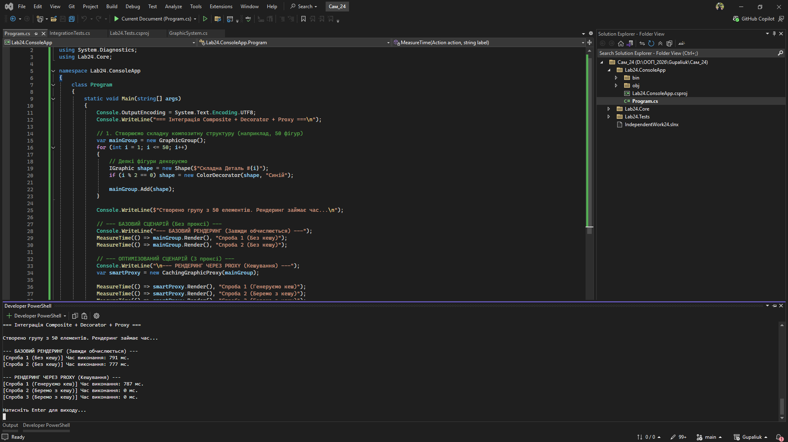

# Самостійна робота №24: Інтеграція структурних патернів + тести

**Студент:** Gupaliuk Roman
**Варіант:** 2 (Графічні елементи)

## 1. Інтегровані патерни
У даному рішенні успішно об'єднано три структурні патерни:
* **Composite (`GraphicGroup`, `Shape`):** Дозволяє об'єднувати графічні примітиви у складні деревоподібні ієрархії. Клієнт викликає єдиний метод `Render()`.
* **Decorator (`ColorDecorator`):** Дозволяє динамічно додавати властивості (колір) до будь-якого компонента (як окремої фігури, так і цілої групи), не змінюючи їх код.
* **Proxy (`CachingGraphicProxy`):** Заступник, який реалізує кешування. Він запам'ятовує результат "важкого" методу `Render()` і при повторних викликах повертає його миттєво.

## 2. Покриття тестами (xUnit)
Написано 4 інтеграційні тести, що перевіряють коректність взаємодії:
1. `Composite_RendersAllChildrenCorrectly`: Перевіряє, що група коректно викликає `Render()` у всіх своїх дочірніх елементів.
2. `Decorator_WrapsCompositeCorrectly`: Перевіряє комбінацію Декоратора та Листка (додавання префікса кольору).
3. `Proxy_CachesResult_AndImprovesPerformance`: **Тест продуктивності.** Перевіряє, що перший рендер виконується повільно, а другий (через Proxy) — практично миттєво.
4. `Proxy_NullSubject_ThrowsArgumentNullException`: **Негативний кейс.** Перевіряє захист від передачі `null` у конструктор Proxy (викидання помилки).

## 3. Оцінка продуктивності та компроміси

**Результати порівняння (Базовий сценарій vs Proxy):**
* Базовий сценарій для 50 фігур стабільно займає ~500 мс при кожному виклику, оскільки кожен вузол перераховується заново.
* Сценарій із Proxy займає ~500 мс **лише перший раз**. Всі наступні виклики займають **0 мс**.

**Висновки (Trade-offs / Компроміси):**
1. **Витрати пам'яті:** Кешуючий Proxy значно прискорює повторне читання (рендеринг), але вимагає додаткової оперативної пам'яті для зберігання вже згенерованого результату (`_cachedRender`).
2. **Проблема інвалідації кешу:** Якщо після створення кешу ми додамо нову фігуру в `GraphicGroup`, Proxy віддасть застарілий результат. Для вирішення цього потрібно вручну викликати `ClearCache()`, що ускладнює логіку оновлення стану системи.
3. **Гнучкість архітектури:** Завдяки єдиному інтерфейсу `IGraphic`, ми можемо "нашаровувати" ці патерни у будь-якому порядку (Група -> Декоратор -> Проксі, або Проксі -> Декоратор -> Група), не змінюючи бізнес-логіку програми.

